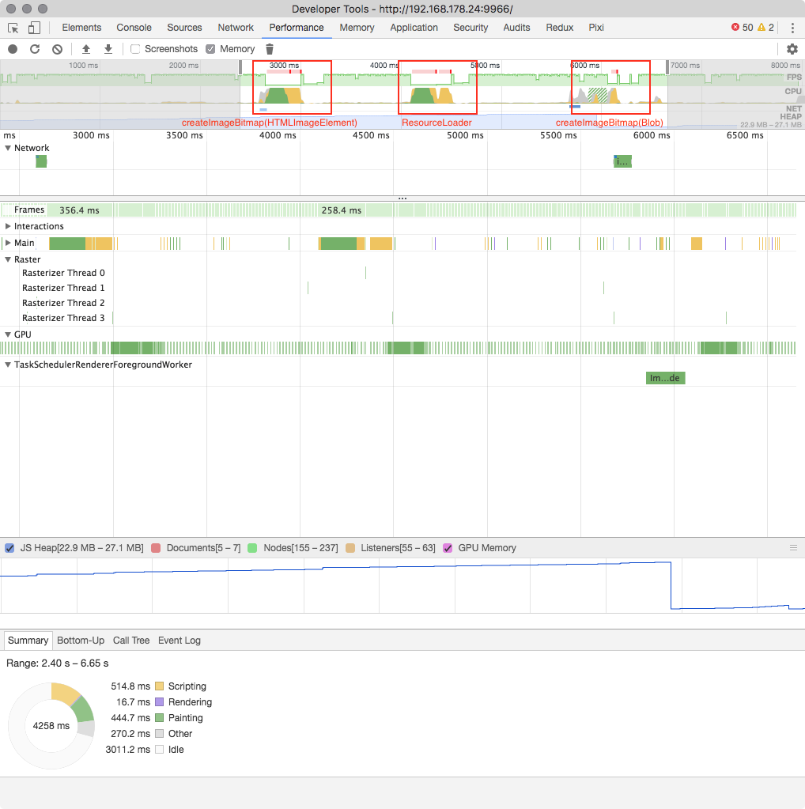

# image decoding performance tests

Some quick tests with pixi.js and `createImageBitmap()` that show the performance of the decoding.

As of now (*January 15th 2018*) `createImageBitmap()` only runs in a separate worker thread if used with `Blob`. In combination with `HTMLImageElement` no separate process is spawned and decoding takes significantly longer.

## Test setup

> Renderer: Pixi.js next
[#cb75b1d](https://github.com/pixijs/pixi.js/commit/a8160890528f0ed8eef988d59500960d8ec6c05b)  
> Browser: Chrome 64.0.3282  
> OS: macOs 10.12.06

### Run
`npm install`  
`npm start`  

Using Google Developer Tools for performance testing!
